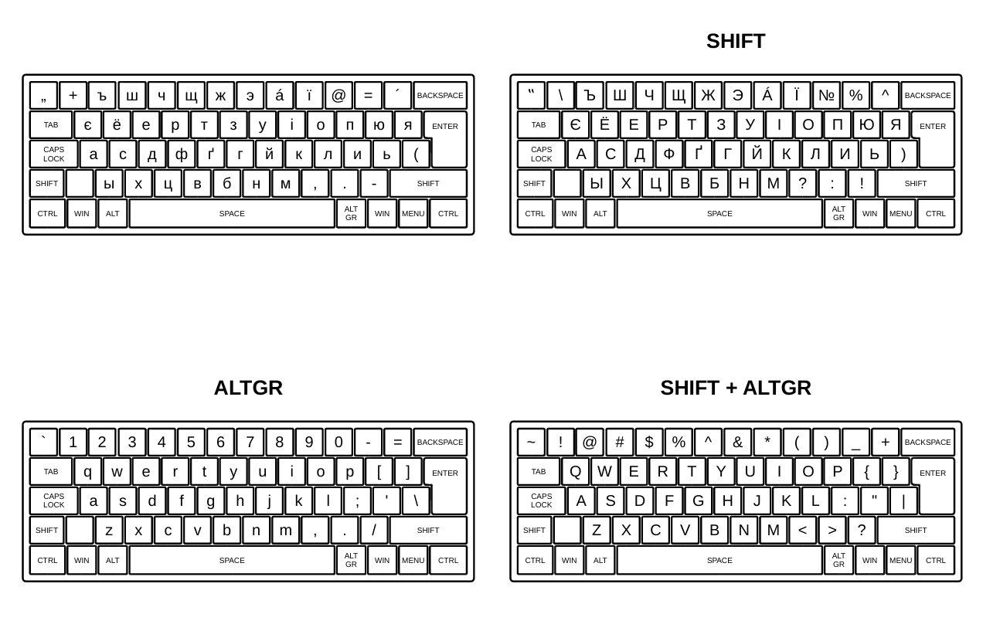

# [TUTORIAL] Rusyn Keyboard Layout on Linux

This guide details the steps to manually add a Rusyn (`rue`) keyboard layout on Linux systems using X11. 

**Tested on:** Ubuntu, Linux Mint.

**Source layout:** Based on the Windows Rusyn keyboard provided by [University of Prešov (UNIPO)](https://www.unipo.sk/cjknm/hlavne-sekcie/urjk/vedecko-vyskumna-cinnost/rusinska-klavesnica).

## Keyboard Layout Overview



## 1. Create the Symbols File

Create a new file in the `xkb/symbols` directory to define the key mappings:

```bash
sudo nano /usr/share/X11/xkb/symbols/rue
```

Paste the following configuration:

```bash
partial alphanumeric_keys
xkb_symbols "basic" {
    name[Group1] = "Rusyn";
    key <TLDE> { [ comma, quotedbl, grave, asciitilde ] };
    key <AE01> { [ plus, backslash, 1, exclam ] };
    key <AE02> { [ Cyrillic_hardsign, Cyrillic_HARDSIGN, 2, at ] };
    key <AE03> { [ Cyrillic_sha, Cyrillic_SHA, 3, numbersign ] };
    key <AE04> { [ Cyrillic_che, Cyrillic_CHE, 4, dollar ] };
    key <AE05> { [ Cyrillic_shcha, Cyrillic_SHCHA, 5, percent ] };
    key <AE06> { [ Cyrillic_zhe, Cyrillic_ZHE, 6, asciicircum ] };
    key <AE07> { [ Cyrillic_e, Cyrillic_E, 7, ampersand ] };
    key <AE08> { [ aacute, Aacute, 8, asterisk ] };
    key <AE09> { [ Ukrainian_yi, Ukrainian_YI, 9, parenleft ] };
    key <AE10> { [ at, numerosign, 0, parenright ] };
    key <AE11> { [ equal, percent, minus, underscore ] };
    key <AE12> { [ dead_acute, asciicircum, equal, plus ] };

    key <AD01> { [ Ukrainian_ie, Ukrainian_IE, q, Q ] };
    key <AD02> { [ Cyrillic_io, Cyrillic_IO, w, W ] };
    key <AD03> { [ Cyrillic_ie, Cyrillic_IE, e, E ] };
    key <AD04> { [ Cyrillic_er, Cyrillic_ER, r, R ] };
    key <AD05> { [ Cyrillic_te, Cyrillic_TE, t, T ] };
    key <AD06> { [ Cyrillic_ze, Cyrillic_ZE, y, Y ] };
    key <AD07> { [ Cyrillic_u, Cyrillic_U, u, U ] };
    key <AD08> { [ Ukrainian_i, Ukrainian_I, i, I ] };
    key <AD09> { [ Cyrillic_o, Cyrillic_O, o, O ] };
    key <AD10> { [ Cyrillic_pe, Cyrillic_PE, p, P ] };
    key <AD11> { [ Cyrillic_yu, Cyrillic_YU, bracketleft, braceleft ] };
    key <AD12> { [ Cyrillic_ya, Cyrillic_YA, bracketright, braceright ] };

    key <AC01> { [ Cyrillic_a, Cyrillic_A, a, A ] };
    key <AC02> { [ Cyrillic_es, Cyrillic_ES, s, S ] };
    key <AC03> { [ Cyrillic_de, Cyrillic_DE, d, D ] };
    key <AC04> { [ Cyrillic_ef, Cyrillic_EF, f, F ] };
    key <AC05> { [ Ukrainian_ghe_with_upturn, Ukrainian_GHE_WITH_UPTURN, g, G ] };
    key <AC06> { [ Cyrillic_ghe, Cyrillic_GHE, h, H ] };
    key <AC07> { [ Cyrillic_shorti, Cyrillic_SHORTI, j, J ] };
    key <AC08> { [ Cyrillic_ka, Cyrillic_KA, k, K ] };
    key <AC09> { [ Cyrillic_el, Cyrillic_EL, l, L ] };
    key <AC10> { [ Cyrillic_i, Cyrillic_I, semicolon, colon ] };
    key <AC11> { [ Cyrillic_softsign, Cyrillic_SOFTSIGN, apostrophe, quotedbl ] };
    key <BKSL> { [ parenleft, parenright, backslash, bar ] };

    key <AB01> { [ Cyrillic_yeru, Cyrillic_YERU, z, Z ] };
    key <AB02> { [ Cyrillic_ha, Cyrillic_HA, x, X ] };
    key <AB03> { [ Cyrillic_tse, Cyrillic_TSE, c, C ] };
    key <AB04> { [ Cyrillic_ve, Cyrillic_VE, v, V ] };
    key <AB05> { [ Cyrillic_be, Cyrillic_BE, b, B ] };
    key <AB06> { [ Cyrillic_en, Cyrillic_EN, n, N ] };
    key <AB07> { [ Cyrillic_em, Cyrillic_EM, m, M ] };
    key <AB08> { [ comma, question, comma, less ] };
    key <AB09> { [ period, colon, period, greater ] };
    key <AB10> { [ minus, exclam, slash, question ] };

    include "level3(ralt_switch)"
};
```

Save and exit the file.

## 2. Register the Layout in X11 Rules

Open the `evdev.xml` file to register the newly created layout:

```bash
sudo nano /usr/share/X11/xkb/rules/evdev.xml
```

Locate `(CTRL+W)` the `</layoutList>` closing tag. Insert the following XML block immediately before `</layoutList>`:

```bash
     <layout>
      <configItem>
        <name>rue</name>
        <shortDescription>rue</shortDescription>
        <description>Rusyn</description>
        <languageList>
          <iso639Id>rue</iso639Id>
        </languageList>
      </configItem>
      <variantList/>
    </layout>
```

Save and exit the file.

## 3. Clear XKB Cache

Clear the cached keyboard configurations to force the system to read the new layout:

```bash
sudo rm -rf /var/lib/xkb/*
```

## 4. Restart and add the Rusyn keyboard

- Restart your computer.
- Open **System Settings.**
- Navigate to **Keyboard** -> **Input Sources.**
- Search for and add **Rusyn.**
